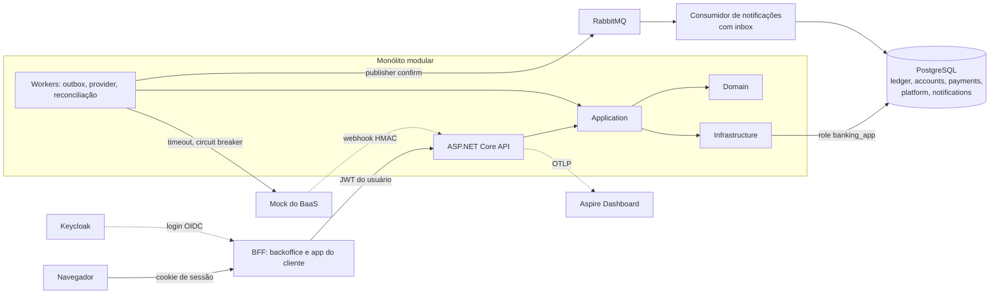

# Banking Core

Núcleo bancário com dinheiro fictício, em .NET 10 e PostgreSQL, construído para estudo e portfólio. O foco é o que costuma dar errado em sistema financeiro: dinheiro criado ou perdido, operação duplicada, concorrência, falha no meio do caminho e acesso indevido. Cada uma dessas garantias tem um teste automatizado que a prova.

[](https://codespaces.new/Gustavo-Marques19/banking-core?quickstart=1)

## O que este projeto prova

| Garantia | Como | Prova |
|---|---|---|
| Nenhum lançamento inconsistente, nem com SQL cru e a credencial da aplicação | O banco calcula saldo e sequência, confere débito = crédito no commit e barra UPDATE/DELETE até do dono das tabelas ([ADR-008](docs/adr/0008-imutabilidade-no-banco.md)) | [`LedgerDatabaseTests`](tests/Banking.IntegrationTests/Ledger/LedgerDatabaseTests.cs) |
| Saldo R$ 1.000 e 100 transferências simultâneas de R$ 100: exatamente 10 passam | Lock de linha em ordem de id ([ADR-004](docs/adr/0004-concorrencia.md)) | [`ConcurrencyTests`](tests/Banking.IntegrationTests/Api/ConcurrencyTests.cs), rodado 50 vezes seguidas no workflow [`stress`](.github/workflows/stress.yml) |
| 100 requisições com a mesma `Idempotency-Key`: uma operação, 100 respostas iguais | Chave reservada no Postgres, na transação da operação ([ADR-005](docs/adr/0005-idempotencia.md)) | [`ConcurrencyTests.Cem_requisicoes_com_a_mesma_chave_geram_uma_operacao`](tests/Banking.IntegrationTests/Api/ConcurrencyTests.cs) |
| Cliente não lê nem move dinheiro de outro | Autorização por recurso; recurso alheio responde 404 ([ADR-009](docs/adr/0009-autenticacao-e-autorizacao.md)) | [`TransferTests`](tests/Banking.IntegrationTests/Api/TransferTests.cs), [`CustomerAndAccountTests`](tests/Banking.IntegrationTests/Api/CustomerAndAccountTests.cs) |
| Só operador cria dinheiro, sempre com contrapartida; acima do limite, outro operador aprova | Depósito `D Funding / C Cliente`, limites e maker-checker | [`DepositTests`](tests/Banking.IntegrationTests/Api/DepositTests.cs), [`HardeningTests`](tests/Banking.IntegrationTests/Api/HardeningTests.cs) |
| Broker fora do ar não perde evento; evento duplicado tem efeito único | Outbox na transação, publisher confirm, `mandatory`, inbox ([ADR-007](docs/adr/0007-outbox-e-inbox.md)) | [`MessagingTests`](tests/Banking.IntegrationTests/Api/MessagingTests.cs), rodado 20 vezes seguidas no workflow `stress` |
| Timeout do provider nunca vira falha nem débito duplo | UNKNOWN gravado antes da chamada; só a consulta ao provider resolve ([ADR-006](docs/adr/0006-transferencia-interna-e-externa.md)) | [`ExternalTransferTests`](tests/Banking.IntegrationTests/Api/ExternalTransferTests.cs), um teste por cenário do mock |
| Adulteração da auditoria por superusuário é detectada | Hash encadeado calculado pelo banco e verificado fora dele | [`AuditTests`](tests/Banking.IntegrationTests/Api/AuditTests.cs) |
| CPF nunca aparece em log, evento ou banco em claro | AES-GCM com blind index, máscara em resposta, `ToString` e logs | [`ObservabilityTests`](tests/Banking.IntegrationTests/Api/ObservabilityTests.cs) |
| Clearing sempre igual às transferências externas em aberto; ledger bate com o extrato do provider | Reconciliação periódica, fonte da métrica `ledger.balance_mismatch` | [`ExternalTransferTests`](tests/Banking.IntegrationTests/Api/ExternalTransferTests.cs) |
| O navegador nunca recebe token; operador não entra no app do cliente, nem cliente no backoffice | BFF com cookie `HttpOnly`, uma instância por front ([ADR-011](docs/adr/0011-bff-para-os-fronts.md)) | [`BffTests`](tests/Banking.IntegrationTests/Api/BffTests.cs), E2E dos dois fronts |
| Clique duplo ou resposta perdida na rede não paga duas vezes | O app gera uma chave de idempotência por intenção de pagamento e a repete no reenvio | [`customer.spec.ts`](web/customer/e2e/customer.spec.ts) |

O [threat model](docs/threat-model.md) liga cada uma das 24 ameaças mapeadas ao teste que cobre a mitigação.

## Arquitetura



- **Monólito modular** ([ADR-001](docs/adr/0001-monolito-modular.md)): um schema por módulo, fronteiras garantidas por testes de arquitetura.
- **Ledger de partida dobrada** ([ADR-003](docs/adr/0003-modelo-contabil.md)): conta do cliente separada da conta contábil; contas de sistema Funding, Settlement e Clearing. Os lançamentos de cada cenário estão em [docs/ledger/lancamentos.md](docs/ledger/lancamentos.md).
- **Dinheiro em centavos** ([ADR-002](docs/adr/0002-representacao-monetaria.md)): `bigint` no banco, string decimal na API, parse que recusa em vez de arredondar.
- **Dois fronts atrás de um BFF** ([ADR-011](docs/adr/0011-bff-para-os-fronts.md)): backoffice para operadores (aprovações, revisão manual, reconciliação, auditoria) e app do cliente (conta, extrato, transferências, avisos), em React. Plano em [docs/plano-frontends.md](docs/plano-frontends.md).
- **Transferência externa em etapas** ([ADR-006](docs/adr/0006-transferencia-interna-e-externa.md)): máquinas de estado em [docs/estados.md](docs/estados.md).

## Como rodar

### Demo em um comando

Precisa de Docker (Codespaces, CI, ou local com Docker/Colima):

```sh
make demo
```

Sobe Postgres e RabbitMQ reais com Testcontainers, hospeda a API no processo e roda os cenários da spec: saldo de R$ 1.000 com 100 transferências simultâneas, idempotência, double spending, broker fora do ar, os cenários de falha do provider, reconciliação e auditoria adulterada. Cada cenário é verificado automaticamente, e o comando falha se algum não passar. O CI roda a demo em todo PR; a saída de uma execução está em [docs/demo-output.md](docs/demo-output.md).

`make bench` mede latência e vazão das transferências (números na [ADR-004](docs/adr/0004-concorrencia.md)).

### No Codespaces

1. Abra pelo botão acima. O ambiente sobe Postgres, Keycloak, RabbitMQ e o Aspire Dashboard, aplica as migrations e gera as chaves de desenvolvimento em user-secrets. Leva alguns minutos na primeira vez.
2. No terminal, `./scripts/dev.sh` sobe a API e os dois fronts e mostra os endereços. As portas são privadas: só você, logado no GitHub, abre esses endereços. Na primeira visita a cada porta, o GitHub mostra um aviso sobre portas de desenvolvimento; clique em "Continue".
   - **App do cliente** (porta 5190): `alice`, `bruno` e `carla`. A `carla` ainda não tem cadastro e serve para ver a abertura de conta.
   - **Backoffice** (porta 5180): `olga` e `otto` (operadores) e `ada` (admin).
   - Senha de todo usuário: `<usuario>-dev-only`.
3. `./scripts/deposit.sh carla 1000` põe dinheiro na conta, depositado pela operadora `olga`. Acima de R$ 10.000, o depósito espera outro operador aprovar no backoffice.

Um roteiro para testar:

| O que testar | Como |
|---|---|
| Transferência interna | Veja o número da conta da `alice` no app dela e transfira para ele como `carla`, passando pela tela de resumo |
| Transferência para outro banco | Banco `00000000`. O começo da conta escolhe o cenário do banco simulado: `SUCCESS-1` conclui, `FAIL-1` é recusada e o dinheiro volta, `TIMEOUT-1` vai para revisão manual |
| Revisão manual | Depois de um `TIMEOUT-`, no backoffice: `olga` registra o desfecho e `otto` aprova |
| Aprovação de depósito | `./scripts/deposit.sh carla 15000` e aprove como `otto`; a `olga`, que pediu, não consegue |
| Separação dos fronts | `olga` no app do cliente e `alice` no backoffice são barradas |
| Auditoria de uma operação | Copie o código no comprovante da transferência, ou abrindo a linha no extrato, e cole em Auditoria no backoffice (`olga` ou `ada`) |

Testes: `dotnet test` (backend), `npm test --workspaces --prefix web` (fronts) e `./scripts/e2e.sh` (E2E dos dois fronts no navegador).

Para hot reload nos fronts, rode `npm run dev` em `web/backoffice` ou `web/customer` junto com `dotnet run --project src/Banking.Bff --launch-profile backoffice` (ou `customer`).

Para não gastar a cota gratuita à toa, em [github.com/settings/codespaces](https://github.com/settings/codespaces) defina idle timeout de 30 minutos e retenção curta.

### Sem Docker

`dotnet build` e `dotnet test --project tests/Banking.UnitTests` (e `Banking.ArchitectureTests`) rodam em qualquer máquina com o SDK do .NET 10.

## Investigando uma transferência

Toda resposta traz `X-Trace-Id`. Com ele, ou com o id da operação:

1. **Trace:** no Aspire Dashboard, busque o trace id. Ele atravessa a requisição, o banco, a publicação no outbox e o consumo da mensagem.
2. **Auditoria:** `GET /api/v1/admin/audit?resourceId={id}` mostra quem fez, o resultado e o mesmo trace id.
3. **Eventos:** `platform.outbox_messages` guarda o envelope publicado; `platform.inbox_messages` mostra quem consumiu.
4. **Dinheiro:** `GET /api/v1/ledger/transactions/{ledgerTransactionId}` mostra os lançamentos, e `GET /api/v1/admin/reconciliation` confere as invariantes.

## Trade-offs

- **Operações na mesma conta são serializadas** pelo lock de linha. É o comportamento correto para uma conta, e o custo aparece no benchmark de conta disputada.
- **A escrita na trilha de auditoria é serializada globalmente** (advisory lock), para o hash encadeado ter uma ordem única. O lock dura só até o commit, mas é um teto de vazão; em volume real, a cadeia seria particionada ou ancorada periodicamente.
- **A reconciliação varre tudo** a cada execução. Em volume real, ela olharia só as contas movimentadas desde a última execução.
- **O outbox é por polling** (1 s por padrão). Change data capture tiraria o polling, ao custo de mais infraestrutura.
- **O provider é um mock em processo.** O contrato já é assíncrono (envio, consulta, extrato, webhook), próximo dos BaaS reais, para a Fase 2 trocar a implementação sem mexer no domínio.
- **Apagar o último registro da auditoria não é detectado** pela verificação da cadeia sozinha. A defesa é ancorar o hash mais recente fora do banco, o que fica para depois.

## O que ficou de fora, e por quê

- **Pix, BaaS real e KYC:** escopo da Fase 2, atrás de `IBankingProvider`.
- **Cartões e holds:** a reserva de transferência externa usa Clearing, sem hold ([ADR-006](docs/adr/0006-transferencia-interna-e-externa.md)). Holds entram com autorização de cartão.
- **Microserviços e deploy em produção:** o monólito modular resolve a Fase 1. Há Dockerfile com imagem chiseled, verificada pelo Trivy, mas não há infraestrutura de produção.
- **Vídeo da demo:** não gravado. A saída de `make demo` no CI cumpre o papel de evidência reproduzível.

## Repositório

| Caminho | Conteúdo |
|---|---|
| `src/Banking.Domain` | Regras de negócio, sem dependência de infraestrutura |
| `src/Banking.Application` | Casos de uso, portas, idempotência, auditoria |
| `src/Banking.Infrastructure` | EF Core, SQL do ledger, outbox, RabbitMQ, provider, reconciliação |
| `src/Banking.Api` | Endpoints, autenticação, rate limiting, observabilidade |
| `src/Banking.Contracts` | Requests e eventos versionados |
| `src/Banking.Bff` | BFF dos dois fronts: login OIDC, sessão por cookie, CSRF, proxy para a API |
| `web/` | Workspace npm: `backoffice`, `customer` (app do cliente) e `shared`, cada front com o seu `DESIGN.md` |
| `tests/` | Unitários (com testes de propriedade), arquitetura e integração com Testcontainers |
| `tools/Banking.Demo` | `make demo` e `make bench` |
| `docs/` | [Plano](docs/plano-fase-1.md), [ADRs](docs/adr/README.md), [lançamentos](docs/ledger/lancamentos.md), [estados](docs/estados.md), [threat model](docs/threat-model.md) |
