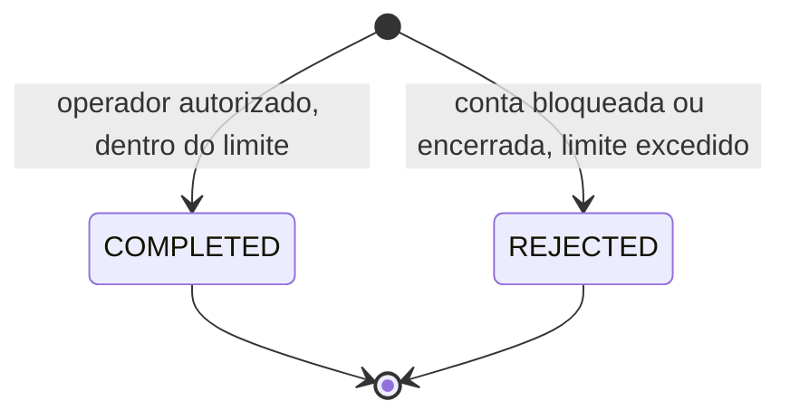
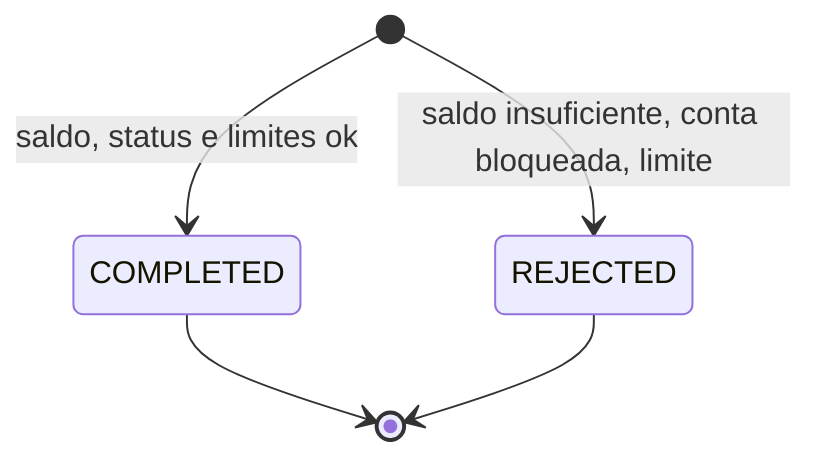
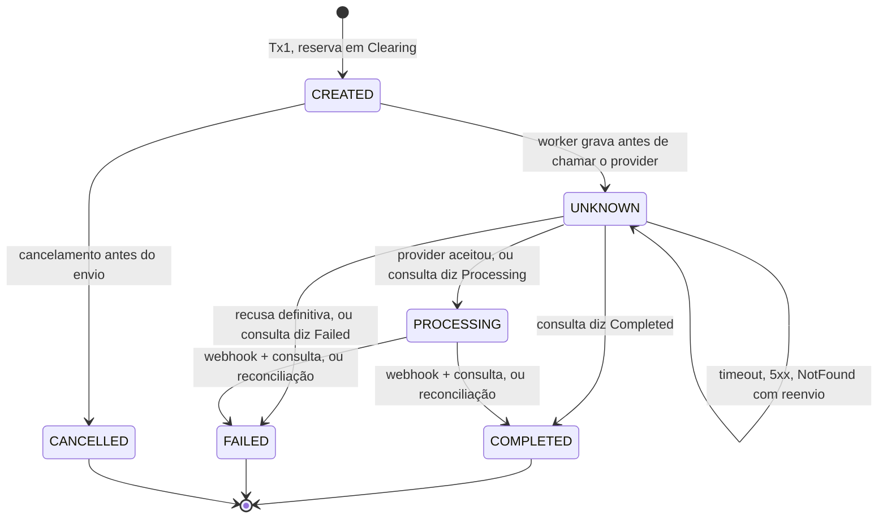
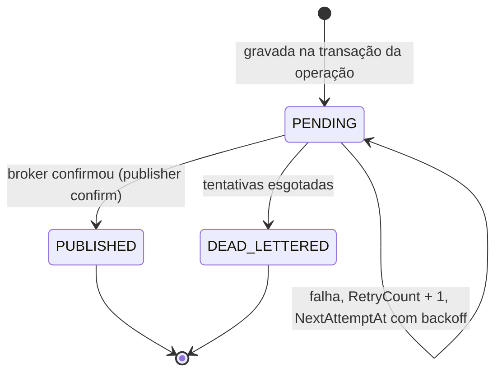

# Máquinas de estado

Estados das operações da Fase 1. O ledger não tem estado: uma transação contábil existe ou não existe ([ADR-003](adr/0003-modelo-contabil.md)).

Toda mudança de estado usa coluna de versão. Se duas partes tentam mudar a mesma operação, uma ganha e a outra relê. Se o estado relido já for terminal, a segunda não faz nada.

## Depósito

A decisão acontece numa única transação, e nenhum estado intermediário é persistido.

## Transferência interna

Também é uma transação só. O estorno (M8) é uma operação nova que aponta para esta, e não muda o estado dela.

## Transferência externa

| Transição | Quem dispara | Lançamento |
|---|---|---|
| → CREATED | API (Tx1) | `D Cliente / C Clearing` |
| CREATED → CANCELLED | cliente ou operador | estorno `D Clearing / C Cliente` |
| CREATED → UNKNOWN | worker de envio, antes da chamada | nenhum |
| UNKNOWN → PROCESSING | worker ou reconciliação | nenhum |
| UNKNOWN ou PROCESSING → COMPLETED | reconciliação ou webhook (confirmado por consulta) | `D Clearing / C Settlement` |
| UNKNOWN ou PROCESSING → FAILED | worker (recusa definitiva), reconciliação ou webhook | estorno `D Clearing / C Cliente` |

`UNKNOWN` quer dizer que a ordem pode ter chegado ao provider. Por isso o worker grava esse estado antes da chamada: se o processo cair no meio, o banco já registra a dúvida.

Sem transição automática de `UNKNOWN` para `FAILED` por tempo. Depois de N tentativas sem resposta conclusiva, a operação continua em `UNKNOWN`, gera alerta e aguarda resolução manual (M8).

## Mensagem de outbox

A entrega é pelo menos uma vez. O consumidor deduplica pelo `event_id` na tabela de inbox (ADR-007, M5).
