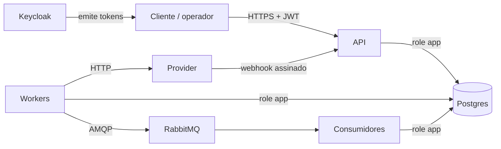

# Threat model v1

A v0 foi feita no M0, antes de existir código. Esta v1, do M8, liga cada ameaça à mitigação implementada e ao teste que a prova. Método: STRIDE por fronteira de confiança.

## O que protegemos

| Ativo | Por que importa |
|---|---|
| Integridade do ledger e dos saldos | Um lançamento errado é dinheiro criado ou perdido. |
| Autorização de movimentação | Só o dono da conta move o dinheiro dela, e só o operador cria dinheiro. |
| CPF e nome dos clientes | Dado pessoal sob a LGPD. Mesmo sendo fictício, o sistema tem que tratá-lo como real. |
| Trilha de auditoria | Sem ela, não dá para provar quem fez o quê. |
| Credenciais e segredos | Senhas de banco, segredo do webhook, chaves de criptografia. |
| Disponibilidade da conta | Uma conta travada por abuso também é um incidente. |

## Atores

- Cliente autenticado: pode tentar acessar recursos de outro cliente.
- Anônimo na internet.
- Operador: pode depositar, e pode abusar disso.
- Administrador: configura o mock.
- Alguém com acesso direto ao Postgres (insider ou credencial vazada).
- Provider externo, ou alguém se passando por ele no webhook.

## Fronteiras de confiança

1. Cliente → API: tudo que chega é não confiável.
2. API e workers → Postgres: a aplicação usa uma role sem DDL e sem UPDATE/DELETE no ledger.
3. Workers → provider e provider → webhook: a rede entre os dois não é confiável.
4. Outbox → broker → consumidores: mensagens podem chegar duplicadas ou fora de ordem.
5. Ambiente de desenvolvimento (Codespaces): portas encaminhadas e segredos.

## Ameaças

Testes em `tests/Banking.IntegrationTests` (IT) e `tests/Banking.UnitTests` (UT), no formato `Classe.Metodo`. Os de front ficam em `web/*/e2e` (E2E, Playwright) e `web/*/src` (UT, Vitest).

| # | STRIDE | Ameaça | Mitigação | Prova |
|---|---|---|---|---|
| T1 | Spoofing | Chamada sem autenticação | JWT RS256 do Keycloak (`iss`, `aud`, `exp`); fallback exige token em toda rota ([ADR-009](adr/0009-autenticacao-e-autorizacao.md)) | IT `AuthenticationTests.Sem_token_responde_401`, `KeycloakTests.Token_do_keycloak_autentica_e_carrega_as_roles` |
| T2 | Elevation | Cliente A lê ou move recursos de B (BOLA) | Autorização por recurso nos casos de uso; recurso alheio responde 404 | IT `CustomerAndAccountTests.Cliente_nao_ve_conta_de_outro`, `TransferTests.Cliente_nao_debita_conta_de_outro_e_nada_e_gravado`, `ExternalTransferTests.Cliente_nao_envia_dinheiro_da_conta_de_outro` |
| T3 | Info disclosure | Chave de idempotência de outro cliente devolve a resposta dele | Escopo `(client_id, operation, key)` ([ADR-005](adr/0005-idempotencia.md)) | IT `DepositTests.Chave_de_outro_operador_nao_colide` |
| T4 | Tampering | Criação de dinheiro sem controle | Depósito só para `operator`, limites por operação e diário, aprovação de outro operador acima do limite | IT `AuthenticationTests.Cliente_em_endpoint_de_operador_responde_403`, `DepositTests.Acima_do_limite_por_operacao_e_recusado_gravado_e_repetido`, `DepositTests.Limite_diario_por_operador_e_respeitado`, `HardeningTests.Deposito_acima_do_limite_de_aprovacao_espera_outro_operador` |
| T5 | Tampering | UPDATE ou DELETE no ledger por quem tem a credencial da aplicação | Role `app` só com SELECT e INSERT; triggers barram alteração até do dono; saldo calculado pelo banco ([ADR-008](adr/0008-imutabilidade-no-banco.md)) | IT `LedgerDatabaseTests.App_nao_altera_nem_apaga_o_ledger`, `LedgerDatabaseTests.Nem_o_dono_das_tabelas_altera_o_ledger`, `LedgerDatabaseTests.Lancamento_desbalanceado_falha_no_commit` |
| T6 | Tampering | Superusuário altera ledger ou auditoria | Não dá para impedir; detecção por hash encadeado verificado fora do banco e por reconciliação | IT `AuditTests.Alteracao_feita_por_superusuario_e_detectada`, `AuditTests.Registro_apagado_por_superusuario_e_detectado`, `ExternalTransferTests.Reconciliacao_aponta_liquidacao_que_so_o_provider_tem` |
| T7 | Tampering | Mass assignment ou campo inesperado no JSON | `UnmappedMemberHandling.Disallow`, campos obrigatórios e anulabilidade respeitados | IT `CustomerAndAccountTests.Campo_desconhecido_no_json_responde_400`; UT `ContractJsonTests` |
| T8 | Tampering | Valor arredondado em silêncio | Parse estrito de `Money`: escala maior é recusada; número JSON é recusado ([ADR-002](adr/0002-representacao-monetaria.md)) | UT `MoneyTests.Parse_rejeita_sem_arredondar`; IT `DepositTests.Valor_invalido_responde_400`, `DepositTests.Valor_como_numero_json_responde_400` |
| T9 | Spoofing | Webhook falso conclui transferência | HMAC com janela de 5 minutos e inbox; o webhook só antecipa a consulta de status | IT `ExternalTransferTests.Webhook_exige_assinatura_valida_e_recente` |
| T10 | Repudiation | Operador nega ter feito uma operação | Auditoria com ator do token, resultado e trace id | IT `AuditTests.Transferencia_fica_auditada_com_ator_e_trace_da_requisicao` |
| T11 | Info disclosure | CPF em log, evento ou banco em claro | AES-GCM com blind index; resposta e `ToString` mascarados; política de log; eventos sem PII | IT `ObservabilityTests.Cpf_nao_aparece_em_log_nem_em_evento`, `CustomerAndAccountTests.Cpf_fica_criptografado_no_banco`; UT `CpfTests.ToString_nunca_mostra_o_cpf_inteiro` |
| T12 | Info disclosure | Segredo commitado | `.env` e user-secrets fora do git; chaves geradas por `scripts/dev-secrets.sh` | CI: job `gitleaks` |
| T13 | Info disclosure | Porta do Codespaces pública | Portas privadas por padrão, documentado no devcontainer | Não automatizado: configuração |
| T14 | Elevation | Endpoint admin do mock usado indevidamente | Só com o mock, fora de produção, com policy `admin` | IT `ExternalTransferTests.Cenario_padrao_do_mock_so_muda_com_admin` |
| T15 | DoS | Usuário martela a conta e esgota o pool esperando lock | Rate limit por `sub`, `lock_timeout` (503 com Retry-After) | IT `HardeningTests.Rate_limit_por_usuario_responde_429_sem_afetar_outros_nem_o_health`, `LedgerDatabaseTests.Lock_de_saldo_segura_a_linha_ate_o_fim_da_transacao` |
| T16 | DoS | Listagem sem limite | Paginação por cursor com máximo de 100 | IT `CustomerAndAccountTests.Extrato_com_pagina_fora_do_limite_responde_400` |
| T17 | Tampering | SQL injection no SQL escrito à mão | Só comandos parametrizados | CI: CodeQL `security-extended` |
| T18 | Elevation | JWT com `alg: none` ou HMAC | Algoritmo fixado em RS256 | IT `AuthenticationTests.Token_invalido_responde_401` |
| T19 | Tampering | Liquidação e estorno da mesma transferência externa, ou liquidação em dobro | `external_id` único para a conclusão; UNKNOWN só sai por consulta ao provider | IT `ExternalTransferTests.Timeout_com_processamento_no_provider_conclui_sem_debito_duplo`; UT `ExternalTransferTests.Estado_terminal_ignora_resultados_atrasados` |
| T20 | Tampering | Evento perdido ou aplicado duas vezes | Outbox na transação, publisher confirm, `mandatory`, inbox ([ADR-007](adr/0007-outbox-e-inbox.md)) | IT `MessagingTests` (broker pausado, app derrubada, entrega duplicada) |
| T21 | Tampering | Operador estorna transferência sozinho | Estorno pedido por um operador e aprovado por outro; recusado se o destinatário já gastou | IT `HardeningTests.Estorno_aprovado_por_outro_operador_devolve_o_dinheiro_com_transacao_ligada`, `HardeningTests.Estorno_e_recusado_se_o_destinatario_ja_gastou` |
| T22 | Information disclosure | Cliente varre números de conta na busca de destino e monta uma lista de clientes | Busca só para `customer`; devolve primeiro nome e inicial do sobrenome, sem CPF nem status; limite próprio de 20 buscas por minuto por usuário | IT `CustomerAndAccountTests.Busca_por_agencia_e_numero_devolve_o_id_e_o_titular_mascarado`, `CustomerAndAccountTests.Busca_de_conta_tem_limite_proprio_por_usuario` |
| T23 | Tampering | Pagamento em dobro por clique duplo ou por reenvio depois de a resposta se perder na rede | O app gera uma chave de idempotência por intenção de pagamento e a repete em todo reenvio; a API devolve a mesma resposta ([ADR-005](adr/0005-idempotencia.md)) | E2E `customer.spec.ts` (resposta perdida na rede, clique duplo); UT `Transfer.test.tsx` |
| T24 | Elevation | Operador usa o app do cliente, ou cliente usa o backoffice | Cada instância do BFF aceita só os próprios papéis, com cliente OIDC e cookie próprios ([ADR-011](adr/0011-bff.md)) | IT `BffTests.Operador_nao_entra_no_app_do_cliente`, `BffTests.Cliente_nao_entra_no_backoffice` |

## Riscos aceitos na Fase 1

- Superusuário do Postgres consegue alterar qualquer coisa (T6). A mitigação é detectar, não impedir.
- Keycloak roda em modo de desenvolvimento no Codespaces. Não é configuração de produção.
- Sem antifraude, KYC ou análise comportamental. Fora do escopo da spec.

## Próxima revisão

Na Fase 2, com o provider real: fronteira de rede com o BaaS (mTLS ou assinatura de requisição), rotação de chaves de PII e do segredo do webhook, e revisão do risco aceito do Keycloak em modo de desenvolvimento.
