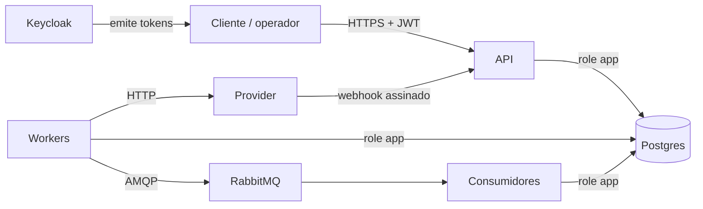

# Threat model v0

Versão inicial, feita no M0 antes de existir código. É revisada no M8 (v1), quando cada ameaça precisa apontar para o teste que a cobre. Método: STRIDE por fronteira de confiança.

## O que protegemos

| Ativo | Por que importa |
|---|---|
| Integridade do ledger e dos saldos | Um lançamento errado é dinheiro criado ou perdido. |
| Autorização de movimentação | Só o dono da conta move o dinheiro dela, e só o operador cria dinheiro. |
| CPF e nome dos clientes | Dado pessoal sob a LGPD. Mesmo sendo fictício, o sistema tem que tratá-lo como real. |
| Trilha de auditoria | Sem ela, não dá para provar quem fez o quê. |
| Credenciais e segredos | Senhas de banco, segredo do webhook, chaves de criptografia. |
| Disponibilidade da conta | Uma conta travada por abuso também é um incidente. |

## Atores

- Cliente autenticado: pode tentar acessar recursos de outro cliente.
- Anônimo na internet.
- Operador: pode depositar, e pode abusar disso.
- Administrador: configura o mock.
- Alguém com acesso direto ao Postgres (insider ou credencial vazada).
- Provider externo, ou alguém se passando por ele no webhook.

## Fronteiras de confiança

1. Cliente → API: tudo que chega é não confiável.
2. API e workers → Postgres: a aplicação usa uma role sem DDL e sem UPDATE/DELETE no ledger.
3. Workers → provider e provider → webhook: a rede entre os dois não é confiável.
4. Outbox → broker → consumidores: mensagens podem chegar duplicadas ou fora de ordem.
5. Ambiente de desenvolvimento (Codespaces): portas encaminhadas e segredos.

## Ameaças

| # | STRIDE | Ameaça | Mitigação | Marco |
|---|---|---|---|---|
| T1 | Spoofing | Chamada sem autenticação a qualquer endpoint | JWT RS256 do Keycloak, validando `iss`, `aud`, `exp` e o algoritmo. Endpoints sem `[AllowAnonymous]` explícito exigem token. | M3 |
| T2 | Elevation | Cliente A move ou lê recursos do cliente B (BOLA) | Autorização por recurso: a conta pertence ao cliente do `sub`, verificado dentro da transação. Recurso alheio devolve 404. | M3, M4 |
| T3 | Info disclosure | Chave de idempotência de outro cliente devolve a resposta dele | Escopo `(client_id, operation, key)` ([ADR-005](adr/0005-idempotencia.md)). | M4 |
| T4 | Tampering | Depósito usado para criar dinheiro sem controle | Só a role `operator` com scope `deposits:write`, limite por operação e por dia, motivo obrigatório. Acima do limite, maker-checker. | M3, M8 |
| T5 | Tampering | UPDATE ou DELETE em lançamentos por alguém com acesso ao banco | Role `app` sem UPDATE/DELETE/TRUNCATE no ledger e na auditoria, trigger que rejeita alteração, constraint de balanceamento no commit. | M2 |
| T6 | Tampering | Superusuário do banco altera o ledger ou a auditoria | Não dá para impedir. Dá para detectar: hash encadeado na auditoria e reconciliação comparando saldos e lançamentos. Risco residual documentado. | M7 |
| T7 | Tampering | Mass assignment ou campos inesperados no JSON | DTOs explícitos, `UnmappedMemberHandling.Disallow`, e o id da conta de origem nunca vem de campo que o cliente não deveria controlar sem verificação. | M3 |
| T8 | Tampering | Valor com escala ou formato inválido arredondado em silêncio | Parse estrito do `Money`: rejeita, não arredonda ([ADR-002](adr/0002-representacao-monetaria.md)). | M2 |
| T9 | Spoofing | Webhook falso do provider marca transferência como concluída | HMAC-SHA256 sobre timestamp + body, janela de 5 minutos, inbox por id do evento. O webhook só dispara consulta de status, e o lançamento usa a resposta da consulta. | M6 |
| T10 | Repudiation | Operador nega ter feito um depósito ou estorno | Auditoria com o `Actor` vindo do token (nunca de header), correlation id e hash encadeado. | M7 |
| T11 | Info disclosure | CPF em logs, eventos ou mensagens de erro | Coluna criptografada com blind index HMAC, política de mascaramento no Serilog, eventos sem PII, ProblemDetails sem stack trace. Teste que procura padrão de CPF nos logs capturados. | M3, M7 |
| T12 | Info disclosure | Segredo commitado no repositório | `.env` no `.gitignore`, só `.env.example` versionado, gitleaks no CI e no pre-commit. | M1 |
| T13 | Info disclosure | Porta do Codespaces pública expõe Keycloak ou a API | Portas privadas por padrão, documentado no devcontainer. | M1 |
| T14 | Elevation | Endpoint admin do mock usado em produção ou por não-admin | Mapeado só em `Development`, com policy `admin`. | M6 |
| T15 | DoS | Cliente martela a própria conta e esgota o pool de conexões esperando lock | Rate limiting por `sub`, `lock_timeout`, pool dimensionado. | M4, M8 |
| T16 | DoS | Listagem de transações sem limite | Paginação por cursor com tamanho máximo. | M3 |
| T17 | Tampering | SQL injection no caminho que usa SQL escrito à mão | Só `FromSqlInterpolated` ou Dapper com parâmetros. Nada de concatenação. | M4 |
| T18 | Elevation | JWT com `alg: none` ou chave simétrica trocada | Algoritmos aceitos fixados em RS256, chaves via JWKS do Keycloak. | M3 |

## Riscos aceitos na Fase 1

- Superusuário do Postgres consegue alterar qualquer coisa (T6). A mitigação é detectar, não impedir.
- Keycloak roda em modo de desenvolvimento no Codespaces. Não é configuração de produção.
- Sem antifraude, KYC ou análise comportamental. Fora do escopo da spec.

## Próxima revisão

No M8: cada linha ganha a coluna "teste", com o link para o teste automatizado que prova a mitigação. Ameaça sem teste fica marcada como aberta.
